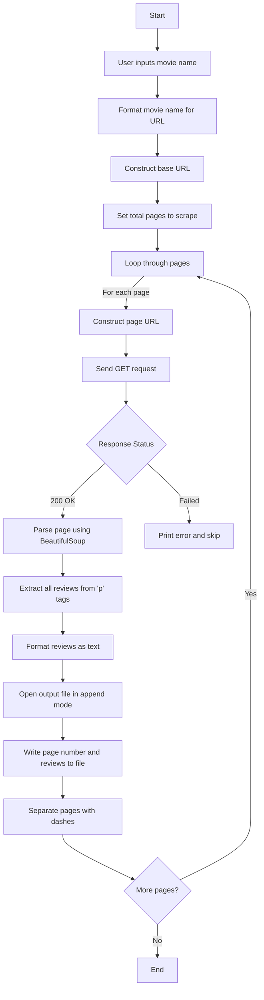
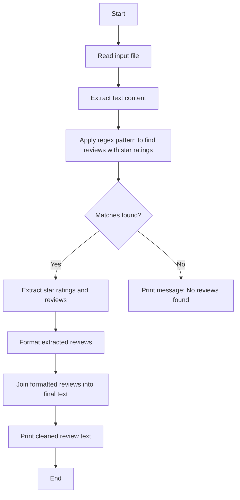
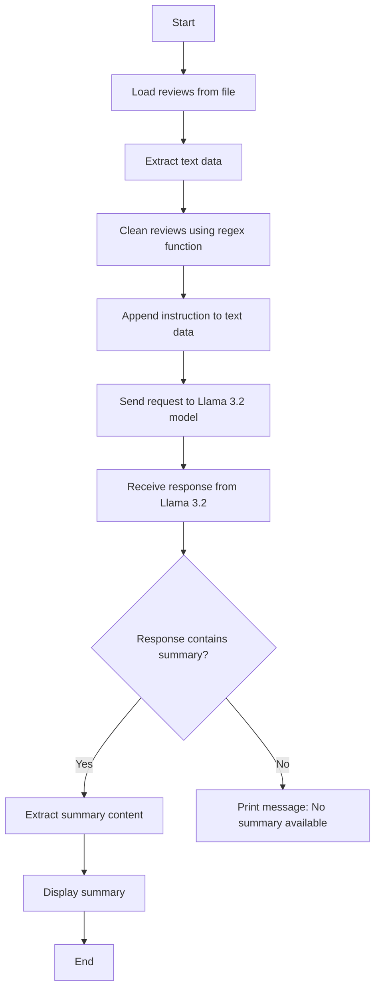

# LetterBoxd-Review-Summarizer

built in python version==3.12.6

## Setup and Running:
1. Download ollama from https://ollama.com/ and install it 

2. install the used models by running this following cmd in promptshell
   
``` bash
ollama pull [MODEL_NAME]
```

3. install python version=3.12.6, create a virtual environment, make sure  that pip is installed, and install the dependencies using this command.
```bash
pip install -r reqlet.txt
```

4. if you are using git, clone this repo by running
```bash
git clone https://github.com/Feininon/LetterBoxd-Review-Summarizer
```
or Download it and unzip it.

5. run 01.reviews.py and enter the movie name correctly

6.  after the txt file containing the scraped data, run 03.llamaSum.py for the summary

## what each script do:

### _01.reviews.py_

This Python script is designed to scrape movie reviews from a specific website (Letterboxd.com) using the `requests` library for HTTP
requests and `BeautifulSoup` for parsing HTML and XML documents. Here's an overview of the key functions and parameters:

- `scrape_page(url):` This function takes a URL as its
argument, sends a GET request to retrieve the webpage
content, parses the HTML using BeautifulSoup, extracts all
the 'p' tags (which contain the reviews), and joins them
into a single string. If the status code of the response is
not 200 (OK), it prints an error message and returns
`None`.

- `scrape_multiple_pages(base_   , total_pages):` This function scrapes multiple pages of reviews
from the given movie by iterating over each page number within the specified range. It opens a text file named
`{formatted_name}_reviews.txt` (where formatted_name is derived from the inputted movie name) and appends the
scraped data for each page to the file, separating them with lines of dashes. If no data is found on a particular
page, it prints an error message but continues scraping the next page.

- In the `usage example`, the script first asks the user to input the name of the movie they want to analyze. It
then formats the movie name (removing spaces and replacing them with "-"), constructs the base URL for the
movie's reviews page on Letterboxd.com, sets the total number of pages to scrape, and finally calls `scrape_multiple_pages()` to perform the actual
scraping.



### _star_clean.py_

 This Python script consists of two new functions, `clean_reviews()` and `process_file()`, that are used to process scraped movie reviews. Here's an
overview of these functions and their parameters:

- `clean_reviews(text):` This function takes a string containing all the scraped reviews as its argument. It uses a regular expression (regex) pattern
to extract reviews with star ratings, where the rating is represented using one or more asterisks followed by a fraction (optional) and a space,
followed by some text (Watched by ...), a number (1-2 digits), a month abbreviation, and a year. The matched reviews are formatted into a list of
strings with each review containing the rating and the corresponding text. Finally, it returns the cleaned review text as a single string, where all
the formatted reviews are separated by two newline characters (`\n\n`). 
-so basically the unwanted data is removed

- `process_file(file_path):` This function takes a file path as its argument, opens the file in read mode, reads the contents into a string variable,
and returns that string. It is used to load the scraped review data from the specified file.




### _03.llamaSum.py_

 This Python script consists of three new functions, `load_reviews()`, `summarize_reviews_with_llama()`, and the main code. Here's an overview of
these functions and their parameters:

- `load_reviews(file_path):` This function takes a file path as its argument, opens the file in read mode, reads the contents into a string variable,
and returns that string. It is used to load the scraped review data from the specified file.

- `summarize_reviews_with_llama(text_data):` This function takes a string containing all the cleaned reviews as its argument. It appends an
instruction to the text data asking the Llama 3.2 model to summarize the reviews within 250 words in English, calls the Llama 3.2 model using the
`ollama` library, and returns the summary as a string. The response from the Llama 3.2 model is parsed to extract the correct structure containing the
summary.

The provided main code sets the file path to `"the-brutalist_reviews.txt"` (replace with your actual file path), calls `load_reviews()` to read the
content of the file, calls `clean_reviews()` to clean and format the reviews, and finally calls `summarize_reviews_with_llama()` to summarize the
cleaned reviews using Llama 3.2. The resulting summary is then printed.




