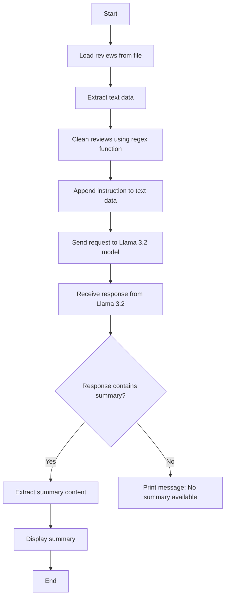

```mermaid
flowchart TD
    A[Start] --> B[Load reviews from file]
    B --> C[Extract text data]
    C --> D[Clean reviews using regex function]
    D --> E[Append instruction to text data]
    E --> F[Send request to Llama 3.2 model]
    F --> G[Receive response from Llama 3.2]
    G --> H{Response contains summary?}
    H -- Yes --> I[Extract summary content]
    H -- No --> X[Print message: No summary available]
    I --> J[Display summary]
    J --> K[End]
```

