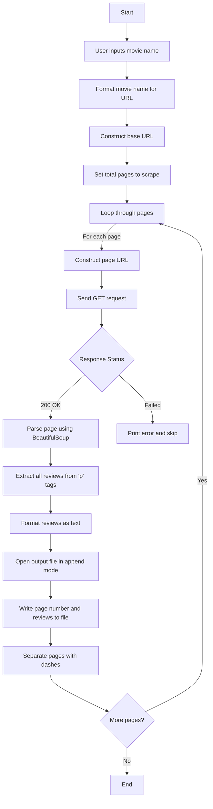

```mermaid
flowchart TD
    A[Start] --> B[User inputs movie name]
    B --> C[Format movie name for URL]
    C --> D[Construct base URL]
    D --> E[Set total pages to scrape]
    E --> F[Loop through pages]
    F -->|For each page| G[Construct page URL]
    G --> H[Send GET request]
    H --> I{Response Status}
    I -- 200 OK --> J[Parse page using BeautifulSoup]
    I -- Failed --> X[Print error and skip]
    J --> K[Extract all reviews from 'p' tags]
    K --> L[Format reviews as text]
    L --> M[Open output file in append mode]
    M --> N[Write page number and reviews to file]
    N --> O[Separate pages with dashes]
    O --> P{More pages?}
    P -- Yes --> F
    P -- No --> Q[End]

```
