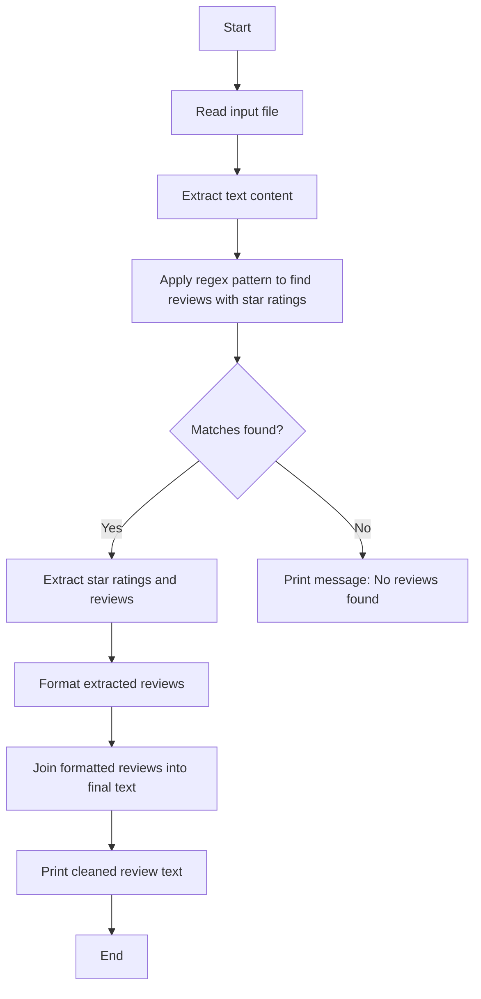

```mermaid
flowchart TD
    A[Start] --> B[Read input file]
    B --> C[Extract text content]
    C --> D[Apply regex pattern to find reviews with star ratings]
    D --> E{Matches found?}
    E -- Yes --> F[Extract star ratings and reviews]
    E -- No --> X[Print message: No reviews found]
    F --> G[Format extracted reviews]
    G --> H[Join formatted reviews into final text]
    H --> I[Print cleaned review text]
    I --> J[End]
```

